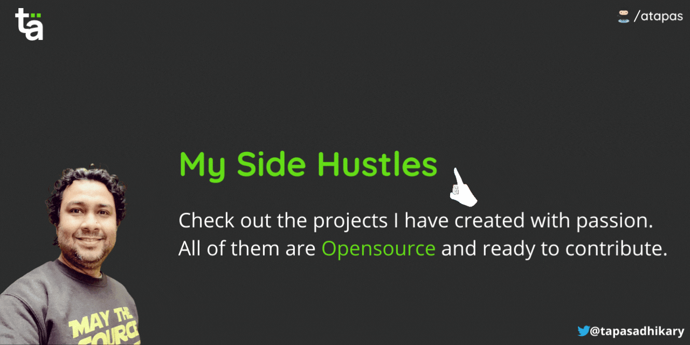

<h2 align="center">Hello there! My name is Tapas Adhikary 👋🤓</h2>

  

  

## 📈 My GitHub Stats
### GitHub Stars

### Top Languages

### GitHub Streak

### GitHub Trophies

## 📦 NPM Packages Published by Me

 

## 🚀 My Side Hustles
Here are my top-most Side Hustles. Most of the projects I have created are opensource. Please consider contributing to them. You are welcome to follow 🤝 me here to stay connected. Who doesn't need motivations? 

Show your support with a star(⭐) if any of my projects inspire you or helpful to you. 

  

## ✍️ I Write For
I'm a Freelance Writer. Here are a few platforms where I have been writing for a while now.

  
CLICK to See my the PLATFORMS I Write For

  

<!-- I-WRITE-FOR:START -->
- [GreenRoots - My Hashnode powered blog](https://blog.greenroots.info/)
- [freeCodeCamp News](https://www.freecodecamp.org/news/author/tapas/)
- [css-tricks.com](https://css-tricks.com/author/tapasadhikary/)
- [DEV Community](https://dev.to/atapas)
- [HACKERnoon](https://hackernoon.com/u/greenroots)
- [daily.dev](https://app.daily.dev/atapas)
- [Bugfender](https://bugfender.com/blog/author/tapasadhikary/)
- [OpenReplay](https://blog.openreplay.com/authors/tapas-adhikary)
- [Aviyel](https://aviyel.com/discussions)
- [Educative Edpresso Shorts](https://www.educative.io/profile/view/6363232210518016)
- [Teal Feed](https://tealfeed.com/tapasadhikary)
- [Dev Dojo](https://devdojo.com/tapasadhikary)
- [Medium](https://medium.com/@tapasadhikary)
<!-- I-WRITE-FOR:END -->
  

  
  

## 📫 You can find me @
<!-- YOU-CAN-FIND-ME:START -->
- [tapaScript on YouTube](https://youtube.com/@tapasadhikary) ▶️
- [X(Twitter)](https://twitter.com/tapasadhikary) 🐤
- [Website](https://tapasadhikary.com/) 🔗
- [Blog](https://blog.greenroots.info/) 💻
- [LinkedIn](https://www.linkedin.com/in/tapasadhikary/) 💼
- [Instagram](https://www.instagram.com/tapascript/) 😎
- [Facebook](https://www.facebook.com/tapasadhi) 😏
<!-- YOU-CAN-FIND-ME:END -->

**Page Views**(Counting since 30th Nov 2020): 
